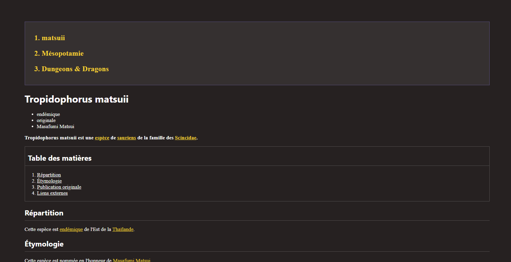
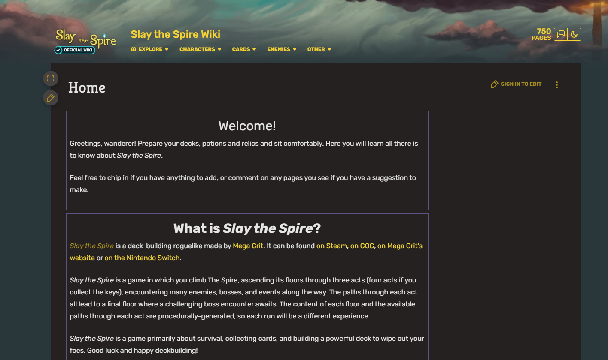
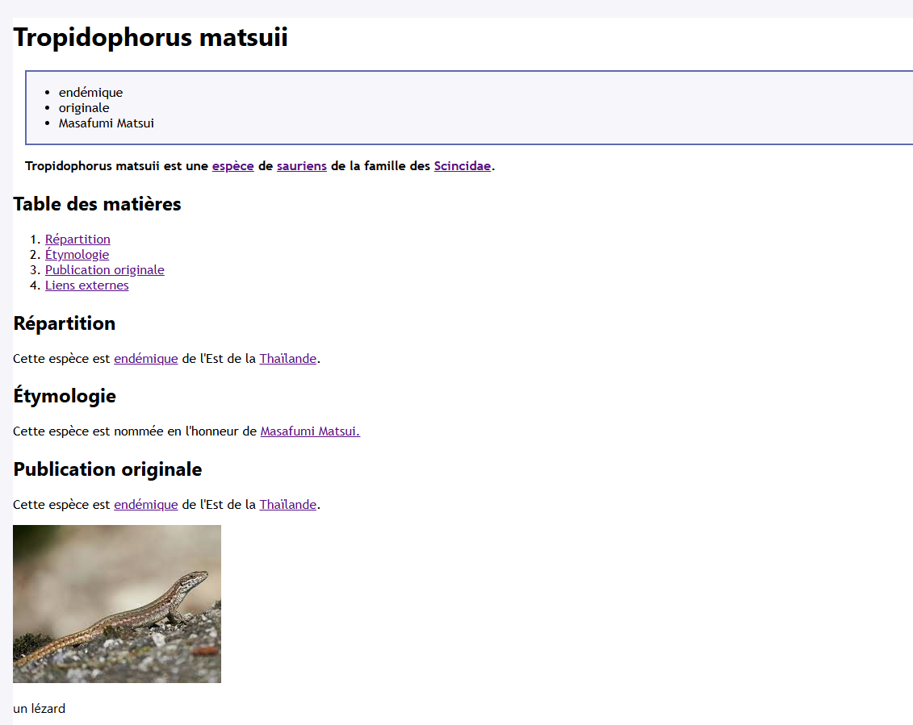

# WIKI GENERATOR

## HOW TO RUN

Install the dependencies using `npm i` in each project  
Start the React application (wiki-react) with `npm run start`  
Generate the builder code from the user-repository directory with `npm run generate`.  
React updates in real time once generate is launched.

## SUBJECT

Creation of a DSL for the graphical interface enabling the development of a web application in the style of an Encyclopedia.

We will generate ReactJS code using an internal TypeScript-based language.

## CONTENT

Wiki content is in `\user-repository\src\model\exemple`

Style of the content is in `\user-repository\src\style-exemple`

You can change the style in `\user-repository\src\index.ts` then do the generate to dynamically change the style

## SCOPE

### COMPONENTS

Page, Title, Subtitle, Sections, Text, List, Background, Font color in a section or title  
Navbar, Table of contents, References, Internal or external links  
Images, Clickable image, Tables, Intra-text link, Collapsible section, Image list  
Theme, Advertisements, Font choice, Search field, Margin on container components  
Tooltips on links that can display images or text

### FEATURES

Responsive (at the user's choice) with element display adaptation,  
Navigation, page creation for an element in responsive version (at the user's choice),  
Default choices suggestions,

## SCREENSHOTS

Our wiki in "Slay the spire wiki style"

Slay the spire wiki

Our wiki in classic style

